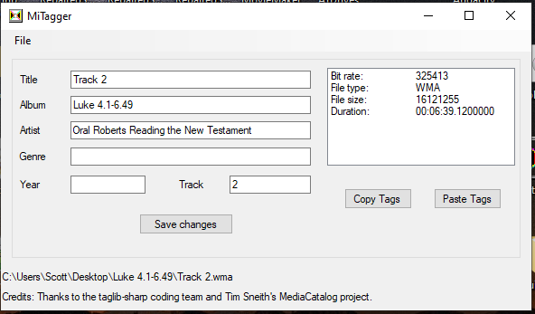

# MiTagger
Simple C# tagger for Windows based on MediaTagSharp.  MiTagger can read and write both MP3 and WMA song tags.

To build:
Unzip MiTagger, MediaTagSharp and SharpZipLib into your Visual Studio Projects directory. Open Visial Studio and navigate to MiTagger.sln

Contact: dxzl@live.com

